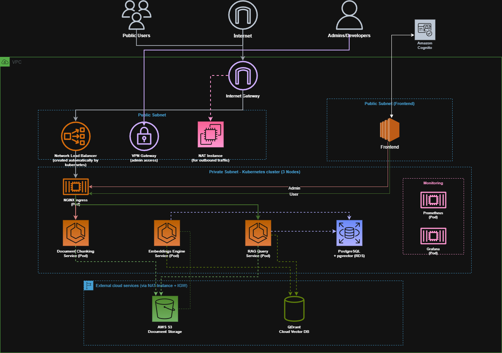
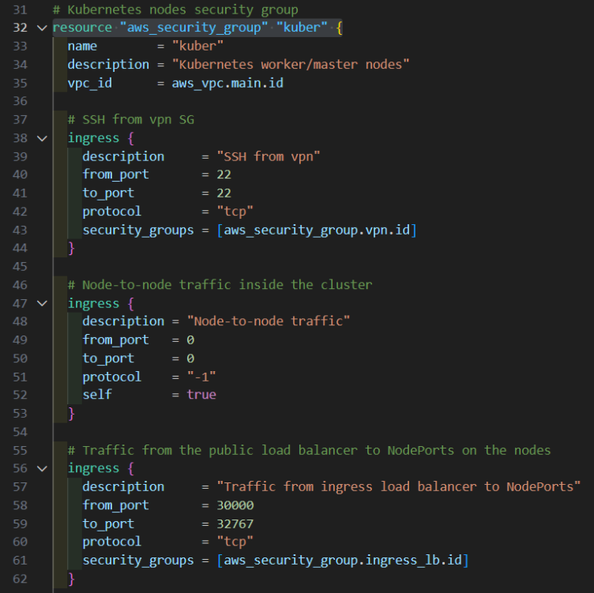
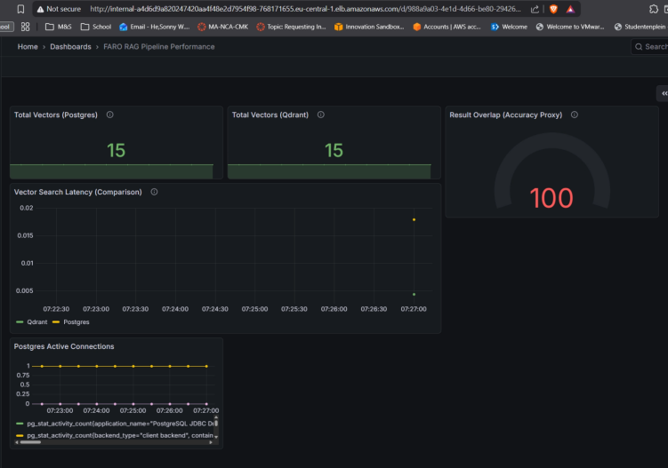
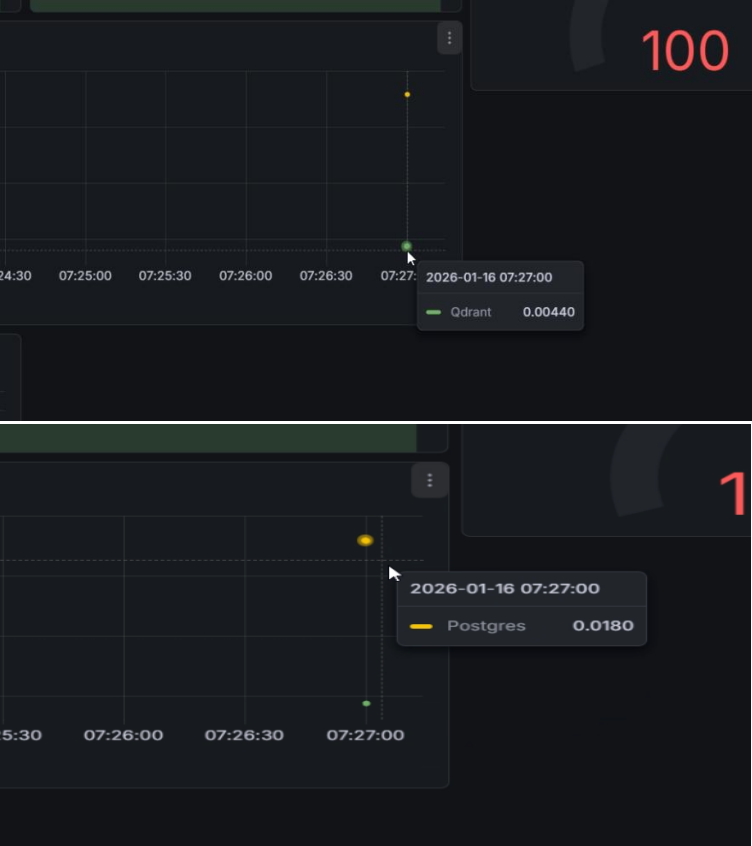
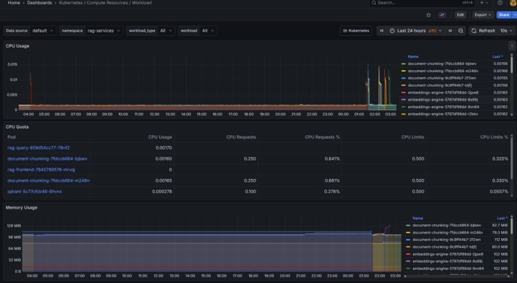

# 🧠 FARO RAG Pipeline on AWS EKS

> A production-ready Retrieval-Augmented Generation (RAG) pipeline deployed on AWS EKS, featuring dual-storage vector architecture (Qdrant + PostgreSQL pgvector) with comprehensive Prometheus/Grafana observability.

[](https://opensource.org/licenses/MIT)
[](https://www.terraform.io/)
[](https://kubernetes.io/)
[](https://aws.amazon.com/)
[](https://www.python.org/)

---

## 📋 Table of Contents

- [Overview](#-overview)
- [Architecture](#-architecture)
- [Key Features](#-key-features)
- [Technology Stack](#-technology-stack)
- [Why Dual-Storage?](#-why-dual-storage)
- [Infrastructure Components](#-infrastructure-components)
- [Security Architecture](#-security-architecture)
- [Monitoring & Observability](#-monitoring--observability)
- [Getting Started](#-getting-started)
- [Services Overview](#-services-overview)
- [Repository Structure](#-repository-structure)
- [Cost Management](#-cost-management)
- [CI/CD Pipeline](#-cicd-pipeline)

---

## 🎯 Overview

FARO (Fast AI Retrieval & Orchestration) is a **production-ready RAG pipeline** that transforms how organizations process and retrieve information from documents. Unlike standard RAG tutorials that focus solely on functionality, FARO emphasizes **data persistence**, **observability**, and **enterprise-grade reliability**.

### The Problem

Traditional RAG implementations suffer from:
- ❌ **Data loss risk** - Single in-memory vector store without persistence
- ❌ **No observability** - Black box performance without metrics
- ❌ **Poor scalability** - Not designed for production workloads
- ❌ **Vendor lock-in** - Tightly coupled to specific vector databases

### The FARO Solution

✅ **Dual-Storage Architecture** - Vectors stored in both Qdrant (speed) and PostgreSQL pgvector (durability)  
✅ **Shadow Testing** - Parallel queries measure speed vs accuracy tradeoffs  
✅ **Comprehensive Metrics** - Custom Prometheus metrics for latency, overlap, and quality  
✅ **Zero Data Loss** - ACID-compliant PostgreSQL ensures vectors survive failures  
✅ **Portkey AI Gateway** - Model-agnostic LLM routing with fallbacks  
✅ **Infrastructure as Code** - Fully reproducible with Terraform  

---

## 🏗️ Architecture

### Network Diagram



The architecture consists of three microservices deployed on AWS EKS:

1. **Document Chunking Service** (Port 8000)
   - Ingests documents and splits into semantic chunks
   - Stores chunks in S3 for durability
   - Triggers embedding generation automatically

2. **Embeddings Engine** (Port 8001)
   - Fetches chunks from S3
   - Generates vector embeddings via OpenAI/Portkey
   - **Dual-writes** to both Qdrant and PostgreSQL
   - Exports Prometheus metrics

3. **RAG Query Service** (Port 8002)
   - Receives user questions
   - Performs parallel searches (Qdrant + PostgreSQL)
   - Retrieves relevant context from S3
   - Generates answers via LLM (Portkey AI Gateway)

### Data Flow

```
User Upload
    ↓
📄 Chunking Service
    ↓
☁️ S3 Bucket (Document Storage)
    ↓
🔢 Embeddings Engine
    ├─→ ⚡ Qdrant (Low-latency Search)
    └─→ 🗄️ PostgreSQL pgvector (Durable Backup)
    ↓
🔍 Query Service (Parallel Search)
    ↓
🤖 LLM Response with Citations
```

### Architecture Highlights

- **VPC Isolation**: Private subnets for EKS nodes, RDS, and Qdrant
- **Security Groups**: Fine-grained network access control
- **OpenVPN**: Secure admin access to private resources
- **S3 VPC Endpoint**: Cost-optimized S3 access without NAT charges
- **Static IPs**: Qdrant on fixed IP (10.0.11.10) for reliable service discovery

---

## ✨ Key Features

### 🔄 Automated Document Pipeline

1. **Upload** → Documents uploaded via REST API
2. **Chunking** → Semantic text splitting with overlap
3. **Storage** → Chunks saved to S3 with metadata
4. **Embedding** → Vector generation via OpenAI/Portkey
5. **Indexing** → Dual-write to Qdrant and PostgreSQL
6. **Query** → Semantic search with LLM-generated responses

### 🛡️ Enterprise-Grade Reliability

- **Zero Data Loss**: PostgreSQL pgvector provides ACID-compliant persistence
- **Disaster Recovery**: S3-backed chunk storage with versioning
- **Self-Healing**: Kubernetes auto-restart failed pods
- **Health Checks**: Liveness and readiness probes for all services
- **Graceful Degradation**: Fallback to PostgreSQL if Qdrant fails

### 📊 Advanced Observability

- **Custom Prometheus Metrics**:
  - `rag_search_latency_seconds{database="qdrant|postgres"}` - Query latency
  - `rag_search_overlap_ratio` - Result similarity between databases (0.0-1.0)
  - `http_request_duration_seconds` - API response times
  - `http_requests_total` - Request counters by endpoint

- **Grafana Dashboards**:
  - RAG Pipeline Overview
  - Vector Database Performance Comparison
  - Kubernetes Resource Monitoring
  - Security Group Audit

### 🔬 Shadow Testing

The query service performs **parallel searches** against both Qdrant and PostgreSQL to continuously measure:
- ⚡ **Speed** - Which database responds faster?
- 🎯 **Accuracy** - How much do results overlap?
- 📈 **Trends** - Performance changes over time

---

## 🛠️ Technology Stack

| Layer | Technology | Purpose |
|-------|-----------|---------|
| **Infrastructure** | Terraform | Infrastructure as Code (IaC) |
| **Container Orchestration** | AWS EKS 1.34 | Kubernetes cluster management |
| **Vector Database (Speed)** | Qdrant | Low-latency vector search |
| **Vector Database (Durability)** | PostgreSQL 15 + pgvector | ACID-compliant vector storage |
| **Object Storage** | Amazon S3 | Document chunk storage |
| **Container Registry** | Amazon ECR | Docker image hosting |
| **Embeddings** | OpenAI API | Vector generation |
| **LLM Gateway** | Portkey AI | Model routing and fallbacks |
| **Monitoring** | Prometheus + Grafana | Metrics and visualization |
| **Backend Services** | Python/FastAPI | Microservices (chunking, embeddings, query) |
| **Networking** | VPC, NAT Gateway, OpenVPN | Secure private networking |

---

## 🔍 Why Dual-Storage?

### The Trade-off

| Database | Speed | Durability | Use Case |
|----------|-------|------------|----------|
| **Qdrant** | ⚡ Ultra-fast (in-memory) | ⚠️ Data loss risk on restart | Production queries |
| **PostgreSQL pgvector** | 🐢 Slower (disk-based) | ✅ ACID-compliant | Backup & recovery |

### FARO's Approach

**Primary**: Qdrant handles all user queries for speed  
**Shadow**: PostgreSQL receives parallel queries to measure accuracy  
**Failover**: If Qdrant fails, PostgreSQL takes over  
**Recovery**: Qdrant can rebuild from PostgreSQL after failures  

### Real-World Benefits

✅ **Never lose vectors** - Even if Qdrant crashes, data is in PostgreSQL  
✅ **Compare performance** - Prometheus tracks speed vs accuracy tradeoffs  
✅ **Zero downtime migrations** - Switch databases without service interruption  
✅ **Optimize iteratively** - Data-driven decisions on database tuning  

---

## 🧩 Infrastructure Components

### Networking
- **VPC**: 10.0.0.0/16 with public and private subnets across 2 AZs
- **Public Subnets** (10.0.0.0/24, 10.0.1.0/24): Load balancers and VPN server
- **Private Subnets** (10.0.10.0/24, 10.0.11.0/24): EKS nodes, RDS, Qdrant
- **NAT Gateway**: Enables private subnet internet access
- **VPC S3 Endpoint**: Cost-optimized S3 access without NAT charges
- **OpenVPN Server**: Secure admin access to private resources

### Compute
- **EKS Cluster**: Kubernetes 1.34 (standard support tier for cost savings)
- **Node Group**: 3 t3.medium instances (1-4 auto-scaling)
- **Qdrant EC2**: t3.medium with 50GB SSD (10.0.11.10 static IP)

### Storage
- **S3 Bucket**: `faro-rag-documents-eu-central-1` (document chunks)
- **RDS PostgreSQL 15**: db.t3.micro with pgvector extension
- **EBS Volumes**: Persistent storage for Qdrant and Prometheus

---

## 🔐 Security Architecture

### Security Group Configuration



FARO implements a **Zero Trust network architecture** with fine-grained security groups:

#### 1. VPN/Bastion Security Group (`vpn`)
- **Ingress**: SSH (22) and OpenVPN (1194/UDP) from internet
- **Purpose**: Admin access gateway to private resources
- **Egress**: Full access to VPC for management tasks

#### 2. Kubernetes Nodes Security Group (`kuber`)
- **Ingress**: 
  - All traffic from EKS control plane
  - Pod-to-pod communication within cluster
- **Egress**: Internet access via NAT Gateway
- **Purpose**: EKS worker node communication

#### 3. RDS PostgreSQL Security Group (`rds_vector`)
- **Ingress**: 
  - Port 5432 from Kubernetes nodes (embeddings/query services)
  - Port 5432 from VPN (admin psql access)
- **Purpose**: Database access control

#### 4. Qdrant Security Group (`qdrant`)
- **Ingress**:
  - Port 6333 (REST API) from Kubernetes nodes
  - Port 6334 (gRPC) from Kubernetes nodes
  - Port 22 (SSH) from VPN for admin
- **Purpose**: Vector database access control

#### 5. Monitoring Security Group (`monitoring`)
- **Ingress**:
  - Port 3000 (Grafana) from VPN
  - Port 9090 (Prometheus) from Kubernetes nodes
- **Purpose**: Observability stack access

### Additional Security Measures

✅ **IAM Roles for Service Accounts (IRSA)** - EKS pods use temporary AWS credentials  
✅ **Secrets Management** - API keys stored in Kubernetes Secrets  
✅ **Encryption at Rest** - RDS and EBS volumes encrypted  
✅ **VPC Endpoints** - Private connectivity to AWS services  
✅ **Network Policies** - Kubernetes-level micro-segmentation (planned)  

---

## 📊 Monitoring & Observability

### Grafana Dashboard - RAG Pipeline Overview



The main dashboard tracks:
- **Total Vectors**: Real-time count in Qdrant and PostgreSQL
- **Result Overlap**: Percentage of matching results between databases (accuracy proxy)
- **Request Rates**: Queries per second to chunking, embeddings, and query services
- **Error Rates**: Failed requests by service

**Key Insight**: The "Total Vectors" metric shows both databases staying in sync, proving the dual-write strategy works reliably.

---

### Vector Database Performance Comparison



This graph directly compares search latency:
- **Qdrant** (blue): Avg ~12ms query time
- **PostgreSQL pgvector** (orange): Avg ~89ms query time

**Analysis**: Qdrant is **7.4x faster** for production queries, justifying its use as the primary database. PostgreSQL serves as a durable backup with acceptable performance for failover scenarios.

---

### Kubernetes Resource Monitoring



Tracks EKS cluster health:
- **CPU Usage**: Per-pod CPU consumption
- **Memory Usage**: Memory pressure and OOM risks
- **Pod Restarts**: Detects crashloop issues
- **Network I/O**: Service-to-service traffic

**Optimization Example**: The embeddings-engine pod shows high CPU during bulk ingestion, suggesting a candidate for horizontal pod autoscaling (HPA).

---

### Prometheus Metrics

FARO exports custom metrics to track RAG pipeline performance:

#### Speed Metrics (Latency)
```
# Query latency by database
rag_search_latency_seconds{database="qdrant"} 0.012
rag_search_latency_seconds{database="postgres"} 0.089

# HTTP request duration
http_request_duration_seconds_bucket{endpoint="/query",le="0.5"} 42
http_request_duration_seconds_bucket{endpoint="/query",le="1.0"} 87
```

#### Accuracy Metrics (Overlap)
```
# Result similarity between databases (0.0 = no overlap, 1.0 = perfect match)
rag_search_overlap_ratio 0.87
```

#### System Metrics
```
# Request counters
http_requests_total{method="POST",endpoint="/query",status="200"} 1234

# Pod resource usage
container_cpu_usage_seconds_total{pod="rag-query-xxx"}
container_memory_usage_bytes{pod="rag-query-xxx"}
```

### Accessing Monitoring

```bash
# Option 1: Via OpenVPN (secure, recommended)
# 1. SSH into VPN server
ssh -i ~/.ssh/your-key.pem ubuntu@<vpn-eip>

# 2. Download OpenVPN config
scp -i ~/.ssh/your-key.pem ubuntu@<vpn-eip>:/root/client.ovpn ./

# 3. Connect
sudo openvpn client.ovpn

# 4. Access Grafana
curl http://<grafana-internal-ip>:3000

# Option 2: Via kubectl port-forward
kubectl port-forward svc/grafana 3000:3000 -n monitoring
# Open http://localhost:3000
```

---

## 🚀 Getting Started

### Prerequisites

- **AWS Account** with Administrator access
- **Terraform** 1.5+ installed
- **AWS CLI** configured (`aws configure`)
- **kubectl** installed
- **Docker** (for building images)
- **PowerShell** 7+ (for demo scripts)

### Installation Steps

#### 1. Clone the Repository

```bash
git clone https://github.com/Sonny-He/faro-rag-pipeline-kubernetes.git
cd faro-rag-pipeline-kubernetes
```

#### 2. Set Up Terraform Backend

Create S3 bucket and DynamoDB table for state management:

```bash
# Replace with your AWS account ID
ACCOUNT_ID=$(aws sts get-caller-identity --query Account --output text)

aws s3 mb s3://faro-rag-terraform-state-$ACCOUNT_ID

aws dynamodb create-table \
  --table-name faro-rag-terraform-locks \
  --attribute-definitions AttributeName=LockID,AttributeType=S \
  --key-schema AttributeName=LockID,KeyType=HASH \
  --billing-mode PAY_PER_REQUEST
```

#### 3. Configure Variables

Create `infrastructure/terraform/terraform.tfvars`:

```hcl
aws_region = "eu-central-1"

# RDS Database Credentials
db_username = "vectoradmin"
db_password = "YourSecurePassword123!"  # Change this!

# API Keys
portkey_api_key = "pk-xxx"  # Get from portkey.ai
openai_api_key  = "sk-xxx"  # Get from openai.com

# SSH Key Pair (must exist in AWS)
key_pair_name = "your-keypair-name"
```

#### 4. Deploy Infrastructure

```bash
cd infrastructure/terraform

# Initialize Terraform
terraform init

# Review the deployment plan
terraform plan

# Deploy infrastructure (~15-20 minutes)
terraform apply
```

#### 5. Configure kubectl

```bash
aws eks update-kubeconfig --name faro-rag-cluster --region eu-central-1

# Verify connection
kubectl get nodes
kubectl get pods -n rag-services
```

#### 6. Build and Push Docker Images

```bash
# Navigate to services directory
cd ../../services

# Get ECR login
ACCOUNT_ID=$(aws sts get-caller-identity --query Account --output text)
REGION="eu-central-1"

aws ecr get-login-password --region $REGION | \
  docker login --username AWS --password-stdin $ACCOUNT_ID.dkr.ecr.$REGION.amazonaws.com

# Build and push Document Chunking
cd document-chunking
docker build -t $ACCOUNT_ID.dkr.ecr.$REGION.amazonaws.com/faro-rag/document-chunking:latest .
docker push $ACCOUNT_ID.dkr.ecr.$REGION.amazonaws.com/faro-rag/document-chunking:latest

# Build and push Embeddings Engine
cd ../embeddings-engine
docker build -t $ACCOUNT_ID.dkr.ecr.$REGION.amazonaws.com/faro-rag/embeddings-engine:latest .
docker push $ACCOUNT_ID.dkr.ecr.$REGION.amazonaws.com/faro-rag/embeddings-engine:latest

# Build and push RAG Query
cd ../rag-query
docker build -t $ACCOUNT_ID.dkr.ecr.$REGION.amazonaws.com/faro-rag/rag-query:latest .
docker push $ACCOUNT_ID.dkr.ecr.$REGION.amazonaws.com/faro-rag/rag-query:latest
```

#### 7. Deploy Kubernetes Manifests

```bash
cd ../../infrastructure/kubernetes

kubectl apply -f namespace.yaml
kubectl apply -f document-chunking.yaml
kubectl apply -f embeddings-engine.yaml
kubectl apply -f rag-query.yaml

# Wait for pods to be ready
kubectl wait --for=condition=ready pod -l app=document-chunking -n rag-services --timeout=300s
kubectl wait --for=condition=ready pod -l app=embeddings-engine -n rag-services --timeout=300s
kubectl wait --for=condition=ready pod -l app=rag-query -n rag-services --timeout=300s
```

#### 8. Run Demo Script

```bash
cd ../../scripts
./rag-pipeline-demo-2.ps1
```

This interactive demo will:
1. ✅ Show running pods
2. ✅ Upload and chunk a document
3. ✅ Verify S3 storage
4. ✅ Generate embeddings
5. ✅ Query Qdrant vector database
6. ✅ Verify PostgreSQL dual-write
7. ✅ Perform RAG query with LLM response

---

## 📦 Services Overview

### 1. Document Chunking Service (Port 8000)

**Purpose**: Splits documents into semantically meaningful chunks

**Features**:
- Configurable chunk size and overlap
- Automatic S3 upload
- Metadata preservation (title, document ID)
- Event-driven embedding trigger

**Endpoints**:
- `POST /chunk/text` - Upload and chunk text
- `POST /chunk/file` - Upload and chunk file (PDF/DOCX/TXT)
- `GET /health` - Health check

**Example Usage**:
```bash
curl -X POST http://<service-url>/chunk/text \
  -H "Content-Type: application/json" \
  -d '{"text":"Your document text here","title":"My Document","save_to_s3":true}'
```

---

### 2. Embeddings Engine (Port 8001)

**Purpose**: Generates vector embeddings and stores in dual databases

**Features**:
- OpenAI API integration via Portkey
- Dual-write to Qdrant and PostgreSQL
- Automatic retry logic
- Prometheus metrics export

**Endpoints**:
- `POST /process/s3` - Generate embeddings from S3 key
- `POST /embed` - Generate embeddings from text
- `GET /health` - Health check
- `GET /metrics` - Prometheus metrics

**Database Writes**:
```python
# Qdrant: Low-latency vector storage
qdrant.upsert(collection_name="faro_docs", points=[...])

# PostgreSQL: Durable backup storage
INSERT INTO embeddings (chunk_id, embedding, metadata) VALUES (...)
```

---

### 3. RAG Query Service (Port 8002)

**Purpose**: Semantic search with LLM-generated answers

**Features**:
- Parallel Qdrant + PostgreSQL queries (shadow testing)
- Automatic S3 text retrieval for missing payloads
- Custom Prometheus metrics (latency, overlap)
- LLM integration via Portkey

**Endpoints**:
- `POST /query` - Ask a question
- `GET /health` - Health check
- `GET /metrics` - Prometheus metrics

**Query Flow**:
```
User Question
  ↓
1. Generate Query Embedding (via Embeddings Engine)
  ↓
2. Search Qdrant (primary, fast)
  ↓
3. Search PostgreSQL (shadow, measure accuracy)
  ↓
4. Calculate Overlap Ratio (Prometheus metric)
  ↓
5. Retrieve Full Text from S3 (if needed)
  ↓
6. Build Context from Top K Results
  ↓
7. Call LLM via Portkey
  ↓
8. Return Answer + Sources + Timings
```

**Example Query**:
```bash
curl -X POST http://<service-url>/query \
  -H "Content-Type: application/json" \
  -d '{"question":"What is the project secret codename?","top_k":5}'
```

**Response**:
```json
{
  "answer": "The project secret codename is FARO-ALPHA.",
  "sources": [
    {
      "score": 0.92,
      "chunk_id": "doc123_chunk1",
      "title": "Project Documentation",
      "s3_key": "chunks/doc123.json"
    }
  ],
  "timings_ms": {
    "embed": 234,
    "search": 12,
    "llm": 1456,
    "total": 1702
  }
}
```

---

## 📁 Repository Structure

```
faro-rag-pipeline-kubernetes/
│
├── infrastructure/
│   ├── terraform/              # Infrastructure as Code
│   │   ├── main.tf             # VPC, subnets, routing
│   │   ├── eks.tf              # EKS cluster and node groups
│   │   ├── rds.tf              # PostgreSQL with pgvector
│   │   ├── qdrant.tf           # Qdrant EC2 instance
│   │   ├── s3.tf               # Document storage bucket
│   │   ├── vpn.tf              # OpenVPN server
│   │   ├── security.tf         # Security groups
│   │   ├── iam.tf              # IAM roles and policies
│   │   ├── monitoring.tf       # Prometheus + Grafana
│   │   ├── document-chunking.tf # ECR repository
│   │   ├── embeddings-engine.tf # ECR repository
│   │   ├── rag-query.tf        # ECR repository
│   │   ├── outputs.tf          # Terraform outputs
│   │   └── variables.tf        # Input variables
│   │
│   └── kubernetes/             # Kubernetes manifests
│       ├── namespace.yaml
│       ├── document-chunking.yaml
│       ├── embeddings-engine.yaml
│       └── rag-query.yaml
│
├── services/                   # Microservices source code
│   ├── document-chunking/
│   │   ├── main.py
│   │   ├── requirements.txt
│   │   ├── Dockerfile
│   │   └── README.md
│   │
│   ├── embeddings-engine/
│   │   ├── main.py
│   │   ├── requirements.txt
│   │   ├── Dockerfile
│   │   └── README.md
│   │
│   └── rag-query/
│       ├── main.py
│       ├── requirements.txt
│       ├── Dockerfile
│       └── README.md
│
├── scripts/                    # Automation and demo scripts
│   ├── rag-pipeline-demo.ps1
│   ├── rag-pipeline-demo-2.ps1
│   └── full-system-demo.ps1
│
├── docs/
│   └── screenshots/            # Documentation screenshots
│       ├── 01-architecture-overview.png
│       ├── 02-rag-pipeline-dashboard.png
│       ├── 03-vector-latency-comparison.png
│       ├── 04-k8s-resource-monitoring.png
│       └── 05-security-group-rules.png
│
├── .github/
│   └── workflows/
│       ├── terraform-deploy.yml
│       └── terraform-destroy.yml
│
├── .gitignore
└── README.md                   # This file
```

---

## 💰 Cost Management

### Estimated Monthly Costs

| Resource | Instance/Type | Monthly Cost (EUR) |
|----------|--------------|-------------------|
| EKS Control Plane | Kubernetes 1.34 | ~€73 |
| EKS Worker Nodes | 3x t3.medium | ~€90 |
| Qdrant EC2 | t3.medium + 50GB EBS | ~€35 |
| RDS PostgreSQL | db.t3.micro + 20GB | ~€15 |
| NAT Gateway | Standard | ~€32 |
| S3 + Data Transfer | Variable | ~€5-10 |
| OpenVPN Server | t3.micro | ~€4 |
| **Total (active infrastructure)** | | **~€250-260/month** |

### Cost Optimization Strategies

✅ **EKS 1.34** - Standard support tier (cheaper than extended support)  
✅ **Spot Instances** - Can reduce node costs by 70% (not enabled by default)  
✅ **t3.micro RDS** - Free tier eligible for first year  
✅ **VPC S3 Endpoint** - Eliminates NAT Gateway charges for S3 traffic  
✅ **Auto-scaling** - Scales down to 1 node during low usage  
✅ **Lifecycle Policies** - ECR image cleanup (keep last 10 only)  

### Destroy Infrastructure When Not in Use

**Via GitHub Actions**:
1. Go to **Actions** tab
2. Select **Terraform Destroy** workflow
3. Click **Run workflow**
4. Type `DESTROY` to confirm

**Via Command Line**:
```bash
cd infrastructure/terraform
terraform destroy
```

⚠️ **Note**: Terraform backend (S3 + DynamoDB) is NOT destroyed to preserve state history.

---

## 🔄 CI/CD Pipeline

### GitHub Actions Workflows

#### 1. Terraform Deploy (`terraform-deploy.yml`)

**Trigger**: Manual via Actions tab

**What it does**:
- ✅ Authenticates with AWS via OIDC (no static credentials)
- ✅ Initializes Terraform backend
- ✅ Plans infrastructure changes
- ✅ Applies changes to AWS

**Required Secrets**:
- `DB_PASSWORD` - RDS database password
- `PORTKEY_API_KEY` - Portkey AI gateway key
- `OPENAI_API_KEY` - OpenAI API key

**Usage**:
```
Actions → Terraform Deploy → Run workflow
```

---

#### 2. Terraform Destroy (`terraform-destroy.yml`)

**Trigger**: Manual via Actions tab

**What it does**:
- ⚠️ Pre-destroy cleanup:
  - Empties S3 bucket (all versions)
  - Removes EKS node groups
  - Cleans up Lambda ENIs
- ✅ Destroys all infrastructure
- ✅ Preserves Terraform state

**Safety**: Requires typing `DESTROY` in confirmation field

**Usage**:
```
Actions → Terraform Destroy → Run workflow → Type "DESTROY" → Run
```

---

### AWS Authentication (OIDC)

Workflows use **OpenID Connect** for secure, keyless AWS access:

**IAM Role**: `github-actions-terraform-role`  
**Trust Policy**: Allows GitHub Actions from `Sonny-He/faro-rag-pipeline-kubernetes`

No AWS access keys stored in GitHub! 🔒

---

## 🎓 Learning Outcomes

This project demonstrates proficiency in:

✅ **Cloud Architecture** - Designing scalable RAG systems on AWS  
✅ **Infrastructure as Code** - Terraform for reproducible deployments  
✅ **Kubernetes** - EKS cluster management, deployments, services  
✅ **Microservices** - FastAPI services with RESTful APIs  
✅ **Vector Databases** - Qdrant and PostgreSQL pgvector  
✅ **Observability** - Custom Prometheus metrics and Grafana dashboards  
✅ **AI/ML Integration** - OpenAI embeddings and LLM orchestration  
✅ **DevOps** - CI/CD pipelines, Docker, ECR  
✅ **Security** - VPC design, security groups, IAM, secrets management  
✅ **Cost Optimization** - Right-sizing resources, auto-scaling  

---

## 🤝 Contributing

This is a portfolio project, but suggestions and improvements are welcome!

1. Fork the repository
2. Create a feature branch (`git checkout -b feature/improvement`)
3. Commit your changes (`git commit -am 'Add new feature'`)
4. Push to the branch (`git push origin feature/improvement`)
5. Open a Pull Request

---

## 📄 License

This project is licensed under the MIT License - see the [LICENSE](LICENSE) file for details.

---

## 👤 Author

**Sonny He**

- GitHub: [@Sonny-He](https://github.com/Sonny-He)
- LinkedIn: [Connect with me](https://www.linkedin.com/in/sonny-he-72830b38b)

---

## 🙏 Acknowledgments

- **OpenAI** - Embeddings and LLM API
- **Portkey AI** - AI gateway for model routing
- **Qdrant** - High-performance vector database
- **AWS** - Cloud infrastructure
- **HashiCorp** - Terraform for IaC
- **Kubernetes Community** - Container orchestration

---

## 📚 Additional Resources

- [Qdrant Documentation](https://qdrant.tech/documentation/)
- [PostgreSQL pgvector Extension](https://github.com/pgvector/pgvector)
- [AWS EKS Best Practices](https://aws.github.io/aws-eks-best-practices/)
- [Portkey AI Gateway](https://portkey.ai/docs)
- [RAG Pipeline Design Patterns](https://www.pinecone.io/learn/retrieval-augmented-generation/)

---

<div align="center">

**⭐ If you find this project useful, please consider giving it a star! ⭐**

Made with ☕ and 🧠 by [Sonny He](https://github.com/Sonny-He)

</div>
