# Document Chunking Service

Splitst documenten (PDF, DOCX, TXT) in kleinere tekstblokken voor de RAG pipeline. Chunks worden automatisch opgeslagen in S3 via IRSA (IAM Roles for Service Accounts).

## Features

- ✅ Tekst chunking met configureerbare grootte en overlap
- ✅ PDF en bestandsverwerking
- ✅ Automatische S3 opslag via IRSA
- ✅ Health checks voor Kubernetes
- ✅ Draait op AWS EKS

## API Endpoints

| Endpoint | Method | Beschrijving |
|----------|--------|--------------|
| `/health` | GET | Health check (inclusief S3 status) |
| `/chunk/text` | POST | Chunk plain text |
| `/chunk/file` | POST | Upload & chunk file |

## Architecture

```mermaid
%%{init: {'theme': 'dark', 'themeVariables': { 'primaryColor': '#ff00ff', 'lineColor': '#00ffff'}}}%%
flowchart LR
    subgraph LOCAL["📁 Local"]
        A["🐍 main.py"]
        B["🐳 Dockerfile"]
    end

    subgraph EKS["☸️ EKS Cluster"]
        C["🟢 Pod"]
        D["🔑 ServiceAccount"]
    end

    subgraph AWS["☁️ AWS"]
        E["🗄️ ECR"]
        F["🪣 S3 Bucket"]
        G["🔐 IAM Role"]
    end

    A --> B
    B -->|push| E
    E -->|deploy| C
    C --> D
    D -->|IRSA| G
    G -->|access| F

    style LOCAL fill:#1a1a2e,stroke:#ff00ff,stroke-width:2px
    style EKS fill:#1a1a2e,stroke:#39ff14,stroke-width:2px
    style AWS fill:#1a1a2e,stroke:#00ffff,stroke-width:2px
```



## Bestanden

| Bestand | Functie |
|---------|---------|
| `main.py` | FastAPI app met /health en /chunk endpoints + S3 integratie |
| `requirements.txt` | Python packages (fastapi, langchain, pypdf, boto3) |
| `Dockerfile` | Container image met Python 3.11 |

## Environment Variables

| Variabele | Default | Beschrijving |
|-----------|---------|--------------|
| `CHUNK_SIZE` | 1000 | Karakters per chunk |
| `CHUNK_OVERLAP` | 200 | Overlap tussen chunks |
| `S3_BUCKET` | - | S3 bucket voor chunk opslag |
| `S3_ENABLED` | false | Activeer S3 opslag |
| `AWS_REGION` | eu-central-1 | AWS regio |

## Request Parameters

| Parameter | Type | Default | Beschrijving |
|-----------|------|---------|--------------|
| `text` | string | required | Tekst om te chunken |
| `chunk_size` | int | 1000 | Karakters per chunk |
| `chunk_overlap` | int | 200 | Overlap tussen chunks |
| `save_to_s3` | bool | true | Opslaan naar S3 |

## Response

```json
{
  "chunks": ["chunk 1...", "chunk 2..."],
  "total_chunks": 2,
  "document_id": "uuid-here",
  "s3_path": "s3://bucket/chunks/uuid.json"
}
```

## Gebruik in EKS

```bash
# Health check (toont S3 status)
kubectl exec deployment/document-chunking -n rag-services -- \
  curl -s http://localhost:8000/health
# Response: {"status":"healthy","s3_enabled":true}

# Chunk tekst met S3 opslag
kubectl exec deployment/document-chunking -n rag-services -- \
  python -c "import requests; print(requests.post('http://localhost:8000/chunk/text', json={'text': 'Je tekst hier...', 'save_to_s3': True}).json())"

# Chunk tekst zonder S3 opslag
kubectl exec deployment/document-chunking -n rag-services -- \
  python -c "import requests; print(requests.post('http://localhost:8000/chunk/text', json={'text': 'Je tekst hier...', 'save_to_s3': False}).json())"

# Bekijk opgeslagen chunks in S3
aws s3 ls s3://faro-rag-documents-eu-central-1/chunks/
```

## IRSA Configuratie

De service gebruikt IRSA voor veilige S3 toegang:

1. **OIDC Provider** - Gekoppeld aan EKS cluster
2. **IAM Role** - `rag-services-s3-role` met S3 permissions
3. **ServiceAccount** - `rag-services-sa` met role annotation
4. **Pod** - Krijgt automatisch AWS credentials via web identity token

```yaml
# ServiceAccount annotatie
eks.amazonaws.com/role-arn: arn:aws:iam::894866952568:role/rag-services-s3-role
```

## Test Resultaten

| Test | Status | Details |
|------|--------|---------|
| Health check | ✅ | `{"status":"healthy","s3_enabled":true}` |
| Kleine tekst | ✅ | 1 chunk, opgeslagen in S3 |
| Grote tekst (1400 chars) | ✅ | 10 chunks, opgeslagen in S3 |
| Custom chunk_size=100 | ✅ | 6 chunks gegenereerd |
| Zonder S3 | ✅ | Geen s3_path in response |
| Speciale karakters | ✅ | Nederlands correct verwerkt |

## Lokaal Testen

```bash
# Build
docker build -t document-chunking .

# Run lokaal (zonder S3)
docker run -p 8000:8000 document-chunking

# Test
curl http://localhost:8000/health
```
